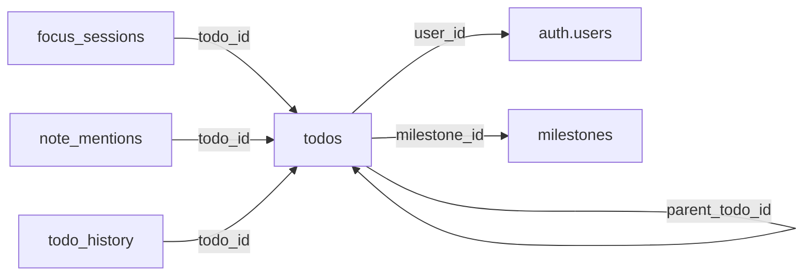
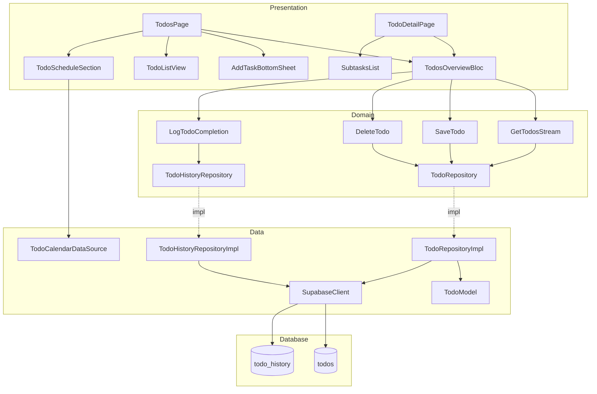

# 📋 Analisis Mendalam Fitur Todo — Ripple

> **Tanggal:** 20 Maret 2026  
> **Project ID:** `afmlpcydtsbwnlumtxav`  
> **Path:** `lib/features/todo/`

---

## 1. Ringkasan Eksekutif

Fitur Todo adalah **core feature terbesar** di Ripple, mengelola 359 todo dari 6 user aktif. Implementasi mengikuti **Clean Architecture** (data → domain → presentation) dengan Supabase sebagai backend. Fitur ini mendukung scheduling, recurring tasks, subtasks, focus mode integration, web link sharing, dan milestone linking.

| Metrik | Nilai |
|--------|-------|
| Total Todos | 359 |
| Active / Completed | 214 / 145 (40.4% completion rate) |
| Scheduled Todos | 223 (62.1%) |
| Recurring Todos | 2 |
| Subtask Parents | 29 (169 subtasks total) |
| Focus Enabled | 48 (13.4%) |
| With Web Link | 2 |
| With Milestone | 0 |
| Unique Users | 6 |
| History Entries | 45 |

### Distribusi Prioritas

| Priority | Count | Persentase |
|----------|-------|------------|
| 🔴 High | 173 | 48.2% |
| 🟡 Medium | 169 | 47.1% |
| 🟢 Low | 17 | 4.7% |

---

## 2. Domain Layer

### 2.1 Entity: `Todo` (214 lines)

**Path:** `domain/entities/todo.dart`

Entity utama dengan **27 fields**, extends `Equatable`:

```
┌─────────────────────────────────────────────────────┐
│                      Todo Entity                     │
├──────────────────────┬──────────────────────────────┤
│ Core                 │ id, userId, title, description│
│ Priority             │ priority (enum: high/med/low) │
│ Status               │ isCompleted, completedAt      │
│ Scheduling           │ isScheduled, scheduledDate,   │
│                      │ startTime, endTime            │
│ Recurrence           │ recurrenceRule (Map), parentId │
│ Focus Integration    │ focusEnabled, focusDuration,  │
│                      │ isPomodoroCustom, shortBreak,  │
│                      │ longBreak, sessionsCount      │
│ Organization         │ milestoneId, category,        │
│                      │ iconPath, webLink             │
│ Notification         │ notificationSent, reminder    │
│ Timestamps           │ createdAt, updatedAt          │
└──────────────────────┴──────────────────────────────┘
```

**Computed Properties:**
- `isRecurring` — apakah punya recurrence rule
- `isRecurrenceInstance` — apakah child dari recurring todo
- `isSubtask` — apakah punya parent todo
- `parsedRecurrenceRule` — parse JSON ke `RecurrenceRule` object

### 2.2 Entity: `RecurrenceRule` (228 lines)

**Path:** `domain/entities/recurrence_rule.dart`

Menggunakan konsep **simplified iCal RRULE**:

- **RecurrenceType:** daily, weekly, monthly, custom
- **Fields:** type, days (0=Sun..6=Sat), interval, until, count
- **Methods:** `shouldOccurOnWeekday()`, `getNextOccurrence()`, `generateOccurrences()`
- **Display:** Localized ke Bahasa Indonesia (Min, Sen, Sel, Rab, Kam, Jum, Sab)
- **Factory constructors:** `RecurrenceRule.weekly()`, `RecurrenceRule.daily()`

### 2.3 Repository Interfaces

| Repository | Methods | Deskripsi |
|-----------|---------|-----------|
| `TodoRepository` | `getTodosStream()`, `getSubtasksStream()`, `saveTodo()`, `deleteTodo()`, `getTodoById()` | CRUD + realtime streams |
| `TodoHistoryRepository` | `logCompletion()` | XP & completion logging |

### 2.4 Use Cases

| Use Case | Input → Output | Fungsi |
|----------|---------------|--------|
| `GetTodosStream` | `void` → `Stream<List<Todo>>` | Subscribe realtime semua todos |
| `SaveTodo` | `Todo` → `Future<Todo>` | Create/update todo |
| `DeleteTodo` | `String id` → `Future<void>` | Delete todo by ID |
| `LogTodoCompletion` | `userId, todoId, completedAt?, xpEarned?` → `Future<void>` | Log ke todo_history |

---

## 3. Data Layer

### 3.1 Model: `TodoModel` (227 lines)

**Path:** `data/models/todo_model.dart`

Extends `Todo` entity, bertanggung jawab untuk **serialization/deserialization**:

- `fromJson()` — Parse Supabase response → TodoModel
- `toJson()` — Serialize ke Map untuk upsert
- `fromEntity()` — Konversi dari entity domain

**Timezone Handling (penting):**
- `scheduled_date` (DATE type): Parse manual sebagai LOCAL date via `_parseDateAsLocal()` — menghindari bug timezone shift dari `DateTime.parse()` yang default ke UTC
- `start_time` / `end_time` (TIMESTAMPTZ): `.toLocal()` saat parsing, `.toUtc()` saat serializing
- `completed_at`, `created_at`, `updated_at`: UTC di DB, local di app

**Icon Normalization:** Menggunakan `TodoIconData.normalizeIconPath()` untuk konsistensi path icon.

### 3.2 Model: `RecurrenceRuleModel` (93 lines)

**Path:** `data/models/recurrence_rule_model.dart`

**Weekday Format Conversion:**

| Format | Sunday | Monday | ... | Saturday |
|--------|--------|--------|-----|----------|
| Flutter/JS | 0 | 1 | ... | 6 |
| DB (ISO) | 7 | 1 | ... | 6 |

Konversi otomatis via `_jsToIsoWeekday()` dan `_isoToJsWeekday()`.

### 3.3 DataSource: `TodoCalendarDataSource` (59 lines)

**Path:** `data/datasources/todo_calendar_datasource.dart`

Adapter untuk **Syncfusion SfCalendar**:
- Hanya menampilkan todos yang `isScheduled && startTime != null`
- Color mapping: High → CoralPink, Medium → WarmTangerine, Low → RippleBlue
- Default 1 jam jika end time tidak ada

### 3.4 Repository Implementations

#### `TodoRepositoryImpl` (111 lines)

- Uses `RepositoryErrorHandler` mixin
- **`getTodosStream()`** — Supabase `.stream()` realtime, ordered by `created_at`
- **`getSubtasksStream()`** — Filtered by `parent_todo_id`
- **`saveTodo()`** — Insert (tanpa ID, let Postgres generate UUID) atau Upsert (dengan ID)
- **`deleteTodo()`** — Simple delete by ID
- **`getTodoById()`** — `.maybeSingle()` query

#### `TodoHistoryRepositoryImpl` (42 lines)

- Insert ke tabel `todo_history` dengan `user_id`, `todo_id`, `completed_at`, dan optional `xp_earned`

---

## 4. Presentation Layer

### 4.1 BLoC: `TodosOverviewBloc` (641 lines)

**Path:** `presentation/bloc/todos_overview_bloc.dart`

#### Events (8):

| Event | Deskripsi |
|-------|-----------|
| `TodosOverviewSubscriptionRequested` | Mulai subscribe ke realtime stream |
| `TodosOverviewTodoSaved` | Save single todo |
| `TodosOverviewTodoSavedWithSubtasks` | Save parent + subtasks atomically |
| `TodosOverviewTodoDeleted` | Delete todo |
| `TodosOverviewFilterChanged` | Change filter (all/active/completed) |
| `TodosOverviewViewModeChanged` | Toggle list ↔ schedule |
| `TodosOverviewClearRequested` | Clear state (logout) |
| `_TodosOverviewTodosUpdated` | Internal: stream update |

#### State:

```dart
TodosOverviewState {
  status: initial | loading | success | failure
  todos: List<Todo>
  filter: all | active | completed
  viewMode: list | schedule
  failure: Failure?
}
```

#### Key Logic:

1. **Optimistic Updates:** Todo disimpan ke local state dulu sebelum API call, revert jika gagal
2. **Recurring Roll-Forward:** Saat recurring todo di-complete, otomatis di-roll ke occurrence berikutnya via `_rollRecurringTodoIfNeeded()` — skip tanggal yang sudah lewat
3. **Completion Logging:** Otomatis log ke `todo_history` saat todo di-complete
4. **Icon Normalization:** Semua icon path dinormalisasi sebelum emit
5. **Error Handling:** Menggunakan `ErrorHandler.handleException()` + `ErrorContext` dengan correlation IDs

### 4.2 Pages

#### `TodosPage` (341 lines)

Halaman utama fitur Todo dengan dua view mode:

- **List Mode:** Filter bar (All/Active/Done) + `TodoListView` widget
- **Schedule Mode:** `TodoScheduleSection` widget

**Fitur Tambahan:**
- Inisialisasi `NotificationService` dan `TimezoneService`  
- Promotional banner check via `BannerService`
- Bottom sheet (`AddTaskBottomSheet`) untuk create/edit todo
- Focus session launch via `PomodoroCubit` → navigate ke `/focus-session`

#### `TodoDetailPage` (572 lines)

Read-only detail page dengan sections:
1. Header + back button
2. Title display dengan completion indicator
3. Web link preview (using `any_link_preview` package)
4. Subtasks list (`SubtasksList` widget)
5. Priority display (3 cards: High/Medium/Low)
6. Schedule info (date, start/end time, reminder)
7. Focus mode info (duration)
8. Action button (Mark Complete/Incomplete) — blokir jika task belum waktunya

### 4.3 Widgets (11 files)

| Widget | Fungsi |
|--------|--------|
| `add_task_bottom_sheet.dart` | Form create/edit todo (bottom sheet) |
| `mini_todo_card.dart` | Card kecil untuk embed di widget lain |
| `priority_todo_card.dart` | Card dengan priority visual |
| `schedule_timeline_preview.dart` | Preview timeline di schedule view |
| `subtasks_list.dart` | List subtasks dengan checklist |
| `timeline_todo_card.dart` | Card untuk timeline view |
| `todo_icon_picker.dart` | Picker icon untuk todo |
| `todo_item.dart` | Item row untuk list view |
| `todo_list_view.dart` | Main list view dengan categories |
| `todo_schedule_section.dart` | Schedule view section wrapper |
| `todo_schedule_view.dart` | Syncfusion calendar view |
| `todo_timeline_view.dart` | Timeline view alternatif |

---

## 5. Database Analysis (Supabase)

### 5.1 Tabel `todos` — 27 Columns

| Column | Type | Nullable | Default | Notes |
|--------|------|----------|---------|-------|
| `id` | uuid | ❌ | `gen_random_uuid()` | PK |
| `user_id` | uuid | ❌ | — | FK → `auth.users` |
| `title` | text | ❌ | — | CHECK: `len >= 1` |
| `description` | text | ✅ | — | |
| `priority` | text | ❌ | `'medium'` | CHECK: `high/medium/low` |
| `is_scheduled` | bool | ❌ | `false` | |
| `scheduled_date` | date | ✅ | — | Local date, no TZ |
| `start_time` | timestamptz | ✅ | — | UTC in DB |
| `end_time` | timestamptz | ✅ | — | UTC in DB |
| `recurrence_rule` | jsonb | ✅ | — | iCal-like JSON |
| `parent_todo_id` | uuid | ✅ | — | Self-FK (subtasks) |
| `focus_enabled` | bool | ❌ | `false` | |
| `focus_duration_minutes` | int | ✅ | `25` | |
| `is_pomodoro_custom` | bool | ✅ | `false` | |
| `pomodoro_short_break_minutes` | int | ✅ | — | |
| `pomodoro_long_break_minutes` | int | ✅ | — | |
| `pomodoro_sessions_count` | int | ✅ | — | |
| `is_completed` | bool | ❌ | `false` | |
| `completed_at` | timestamptz | ✅ | — | |
| `notification_sent` | bool | ❌ | `false` | |
| `milestone_id` | uuid | ✅ | — | FK → `milestones` |
| `reminder_minutes` | int | ✅ | `5` | |
| `icon_path` | text | ✅ | — | |
| `category` | text | ✅ | — | |
| `web_link` | text | ✅ | — | URL dari share intent |
| `created_at` | timestamptz | ❌ | `now()` | |
| `updated_at` | timestamptz | ❌ | `now()` | |

### 5.2 Foreign Key Constraints



### 5.3 Indexes (6)

| Index | Type | Definition |
|-------|------|------------|
| `todos_pkey` | UNIQUE | `(id)` |
| `idx_todos_user_id` | BTREE | `(user_id)` |
| `idx_todos_scheduled_date` | PARTIAL BTREE | `(user_id, scheduled_date) WHERE is_scheduled = true` |
| `idx_todos_milestone` | PARTIAL BTREE | `(milestone_id) WHERE milestone_id IS NOT NULL` |
| `idx_todos_recurrence_templates` | PARTIAL BTREE | `(user_id) WHERE recurrence_rule IS NOT NULL AND parent_todo_id IS NULL` |
| `idx_todos_parent_todo_id` | PARTIAL BTREE | `(parent_todo_id) WHERE parent_todo_id IS NOT NULL` |

### 5.4 RLS Policy

| Policy | Command | Condition |
|--------|---------|-----------|
| `todos_all` | ALL | `auth.uid() = user_id` |

Single policy mencakup SELECT, INSERT, UPDATE, DELETE — user hanya bisa akses data mereka sendiri.

### 5.5 Tabel `todo_history` — 5 Columns

| Column | Type | Default |
|--------|------|---------|
| `id` | uuid | `gen_random_uuid()` |
| `user_id` | uuid | — |
| `todo_id` | uuid | — (nullable) |
| `completed_at` | timestamptz | `now()` |
| `xp_earned` | int | — (nullable) |

FK ke `auth.users` dan `todos`. Digunakan untuk gamification/XP tracking.

---

## 6. Dependency Map



---

## 7. Temuan & Rekomendasi

### ✅ Hal yang Baik

1. **Clean Architecture** diterapkan dengan benar — separation of concerns jelas antara data/domain/presentation
2. **Optimistic Updates** di BLoC untuk UX yang responsif
3. **Timezone handling** yang hati-hati di `TodoModel` — terutama `_parseDateAsLocal()` untuk DATE type
4. **Partial indexes** di database — efisien untuk query pattern yang spesifik
5. **RLS enabled** — keamanan data per-user terjamin
6. **Recurring roll-forward** logic yang memperhitungkan overdue tasks
7. **Realtime streams** via Supabase untuk sync antar device
8. **Error handling** yang komprehensif dengan correlation IDs untuk tracing

### ⚠️ Area Perhatian

1. **`updated_at` tidak auto-update** — Tidak ada trigger database untuk auto-update `updated_at`. Kolom ini hanya diupdate dari client-side, rentan inkonsistensi jika ada direct DB update.

2. **Milestone integration unused** — 0 todos memiliki `milestone_id`, padahal FK sudah ada. Fitur ini belum terhubung di UI.

3. **Recurring todos sangat sedikit (2)** — Fitur recurrence sudah diimplementasikan secara penuh tapi jarang digunakan. Mungkin perlu UX improvement untuk discoverability.

4. **No soft-delete** — Todos langsung dihapus (hard delete). Tidak ada mekanisme trash/undo selain optimistic revert.

5. **Subtask saving sequential** — Di `_onTodoSavedWithSubtasks`, subtasks disave satu per satu via loop, bisa lambat untuk banyak subtasks. Pertimbangkan batch insert.

6. **No pagination** — `getTodosStream()` mengambil semua todos tanpa limit/pagination. Dengan 359 todos saat ini masih OK, tapi bisa jadi masalah saat data membesar.

7. **`copyWith` tidak bisa set null** — Pattern `copyWith` tidak memiliki mekanisme untuk menset field ke `null` (misalnya clear `scheduledDate`). Perlu nullable wrapper pattern.

---

## 8. File Structure Summary

```
lib/features/todo/
├── data/
│   ├── datasources/
│   │   └── todo_calendar_datasource.dart    (59 lines)
│   ├── models/
│   │   ├── recurrence_rule_model.dart       (93 lines)
│   │   └── todo_model.dart                  (227 lines)
│   └── repositories/
│       ├── todo_history_repository_impl.dart (42 lines)
│       └── todo_repository_impl.dart        (111 lines)
├── domain/
│   ├── entities/
│   │   ├── recurrence_rule.dart             (228 lines)
│   │   └── todo.dart                        (214 lines)
│   ├── repositories/
│   │   ├── todo_history_repository.dart     (9 lines)
│   │   └── todo_repository.dart             (10 lines)
│   └── usecases/
│       ├── todo_history_usecases.dart       (21 lines)
│       └── todo_usecases.dart               (21 lines)
└── presentation/
    ├── bloc/
    │   └── todos_overview_bloc.dart          (641 lines)
    ├── pages/
    │   ├── todo_detail_page.dart             (572 lines)
    │   └── todos_page.dart                   (341 lines)
    └── widgets/
        ├── add_task_bottom_sheet.dart
        ├── mini_todo_card.dart
        ├── priority_todo_card.dart
        ├── schedule_timeline_preview.dart
        ├── subtasks_list.dart
        ├── timeline_todo_card.dart
        ├── todo_icon_picker.dart
        ├── todo_item.dart
        ├── todo_list_view.dart
        ├── todo_schedule_section.dart
        ├── todo_schedule_view.dart
        └── todo_timeline_view.dart
```

**Total: 26 files** | **Domain: 6 files** | **Data: 5 files** | **Presentation: 15 files**
